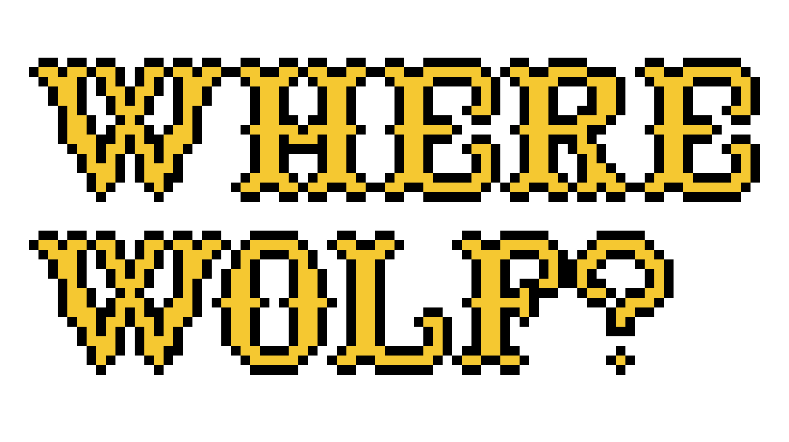
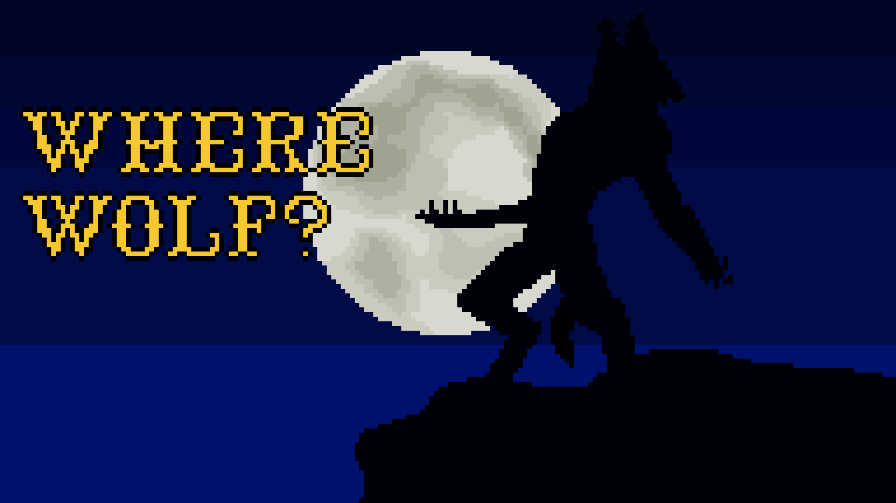
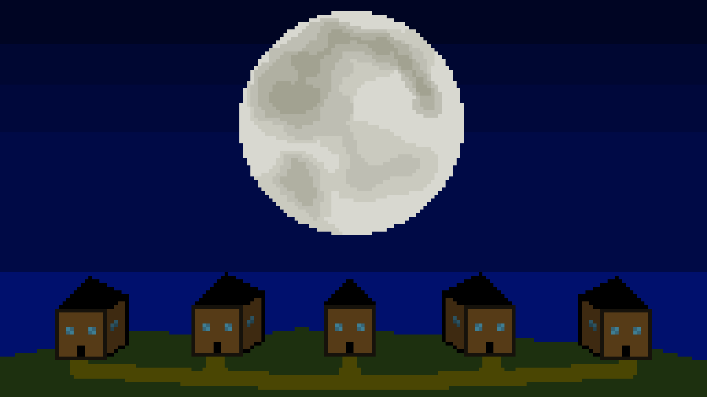
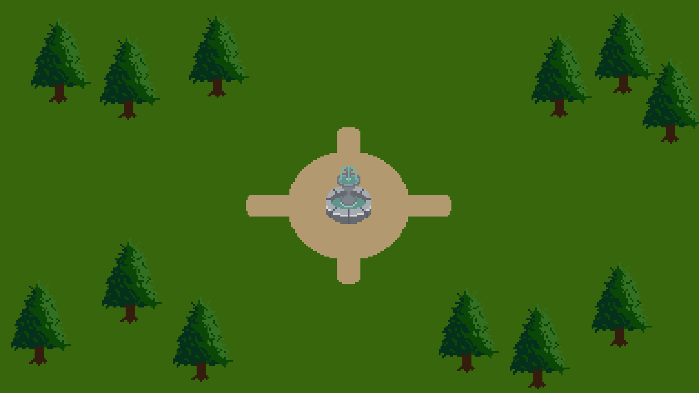

<p align="center">
  
</p>

<h1 align="center">🐺 Where Wolf ?</h1>

Projet NSI n°3 • Jeu de rôle multijoueur inspiré des Loups-Garous de Thiercelieux


## 📖 À propos

Where Wolf ? est un jeu de rôle multijoueur réalisé entièrement en Python.  
Le projet est fortement inspiré des *Loups-Garous de Thiercelieux* tout en proposant son propre univers et ses mécaniques originales.

Ce projet a été développé en équipe de **8 personnes** dans le cadre de la spécialité NSI.


## 🎯 Pourquoi ce projet ?

Nous voulions créer un véritable jeu multijoueur auquel nous pourrions jouer ensemble.

Le projet nous a permis de :
- travailler en équipe sur un gros projet,
- apprendre à organiser du code à plusieurs,
- créer un univers graphique complet,
- développer un jeu fonctionnel de A à Z. 


## 🐺 Ce qui différencie Where Wolf ?

### ✨ Des rôles inédits
Le jeu possède plusieurs rôles originaux absents du jeu de base.

### 🎨 Un univers pixel art
Tous les graphismes ont été réalisés par notre équipe dans un style pixel art.

### 🌐 Un jeu multijoueur
Les joueurs peuvent rejoindre une partie en ligne et interagir en temps réel.


## 📸 Aperçu  
Fond du menu principal  
  
Nuit  
  
Village  
    

## ⚙️ Pré-requis

- Python 3.x
- Une connexion réseau pour le multijoueur
- Un ordinateur capable de faire tourner le projet


## 📦 Installation

### 1. Cloner le projet
### 2. Installer les dépendances
```pip install -r requirements.txt```  

## ▶️ Lancer le projet
```python main.py```
